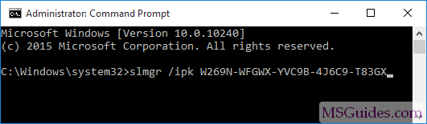

# ActivateWindow

1: open cmd and type this command

slmgr /ipk W269N-WFGWX-YVC9B-4J6C9-T83GX

 

 Replace SERIAL NUMBER HER with any of these, according your Windows 10 installation type. 
          Home/Core                  &nbsp;          TX9XD-98N7V-6WMQ6-BX7FG-H8Q99         
          Home/Core (Country Specific)     &nbsp;    PVMJN-6DFY6-9CCP6-7BKTT-D3WVR   
          Home/Core (Single Language)       &nbsp;   7HNRX-D7KGG-3K4RQ-4WPJ4-YTDFH   
          Home/Core N                      &nbsp;    3KHY7-WNT83-DGQKR-F7HPR-844BM  
          Professional                       &nbsp;  W269N-WFGWX-YVC9B-4J6C9-T83GX  
          Professional N                     &nbsp;  MH37W-N47XK-V7XM9-C7227-GCQG9  
          Enterprise                          &nbsp; NPPR9-FWDCX-D2C8J-H872K-2YT43  
          Enterprise N                        &nbsp; DPH2V-TTNVB-4X9Q3-TJR4H-KHJW4  
          Education                           &nbsp; NW6C2-QMPVW-D7KKK-3GKT6-VCFB2  
          Education N                         &nbsp; 2WH4N-8QGBV-H22JP-CT43Q-MDWWJ  
          Enterprise 2015 LTSB                &nbsp; WNMTR-4C88C-JK8YV-HQ7T2-76DF9  
          Enterprise 2015 LTSB N              &nbsp; 2F77B-TNFGY-69QQF-B8YKP-D69TJ  
          Enterprise 2016 LTSB                &nbsp; DCPHK-NFMTC-H88MJ-PFHPY-QJ4BJ   
          Enterprise 2016 LTSB N             &nbsp;  QFFDN-GRT3P-VKWWX-X7T3R-8B639  
